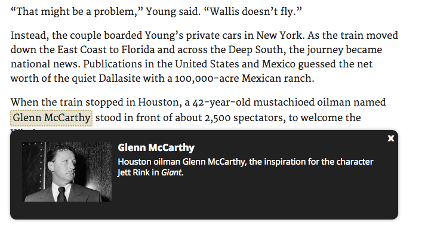

# need2know
jQuery plugin to create glossary style popups for highlighted words.



#### Intro

Does your story have a large cast of characters or locales that may or may not be hard for a reader to keep track of? Looking for a way to allow readers to quickly get a refresher on who or where someone is by simply hovering over their name? Enter need2know, a jquery plugin that displays a small, glossary-style popup beneath a highlighted name or place when the reader hovers/clicks on it. The content of the glossary popup is powered by a JSON array that you'll need to setup, but we'll walk you through that.

##### Dependicies

**JQUERY:** This being a jquery plugin requires jquery.

####Setup
**HTML:** Place the contents of the `glossary.html` file at the top of your body tag within your document. For best results, make sure your body tag has a css `position` attribute set.

**CSS and JS**: Copy the `need2know.css` and `need2know.js` files (or the minified versions) to your own css and javascript directories. Be sure to include calls to those files within your html document.

#### Targeting your glossary terms
To highlight a person, place, phrase, etc. for inclusion in your glossary, simply surround the text with a `span` tag. The `span` tag will need a `class` of gloss and a `data-entry` attribute, which will be set to the term you want to define (usually the name of a person or place). For example:

```html
It's hard to say the name <span class="gloss" data-entry="Aaron Burr">Aaron Burr</span> when you have a mouth full of peanut butter.
```

#### Creating your glossary
As I mentioned above, need2know is powered by a list of terms you define within a JSON array. Each object within the array requires a name and definition, and optionally, could include an image. You can see a sample of the glossary format in the js folder of this project, or right here:

```javascript
var sample = [
		{
			name: "Aaron Burr",
			definition: "An American politician who shot and killed Alexander Hamilton in a duel in 1804. He's also the subject of this fantastic <a href='https://www.youtube.com/watch?v=OLSsswr6z9Y' target ='_blank'>commercial.</a>"
		},
		{
			name: "Alexander Hamilton",
			definition: "Alexander Hamilton was a founding father of the United States and the first US Secretary of the Tresaury. He was also on the losing end of a duel with Aaron Burr.",
			image: "images/hamilton.jpg",
			imageAlt: "Alexander Hamilton, portrayed here shortly after the American Revolution."
		}
	];
```

*Required keys:* Each object must have a `name` and `definition` key. The `name` key should match the value for the `data-entry` attribute on the corresponding `span` tag. The `definition` will be the text that appears in the glossary popup.
*Optional keys:* If you want to include an image with your entry, define the image path as the value of the `image` key. The `imageAlt` key is optional, even with the use of the `image` key, but you really should supply alt text for your images.

#### Using the plugin

Once your glossary JSON is defined and your terms are highlighted, you may invoke need2know by simply calling the need2know function on the id of the div of your glossary. need2know has one required setting (`glossary`) and two optional settings (`theme` and `spacer`).

`glossary`: The name of the array where you defined your glossary JSON.

`theme`: A string with the theme type. need2know has two themes, `light` and `dark`, and defaults to `dark`.

`spacer`: An integer defining the amount of space below your highlighted terms your want your glossary popup to appear. The default is 10px. Note: You do not need to include the unit of measure when you define `spacer`, just an integer.


##### Using need2know without any options
```javascript
$("#my-glossary").need2know({glossary: sampleGlossary});
```

##### Using need2know with options
```javascript
$("#my-glossary").need2know({
  glossary: sampleGlossary,
  theme: "light",
  spacer: 20
});
```
